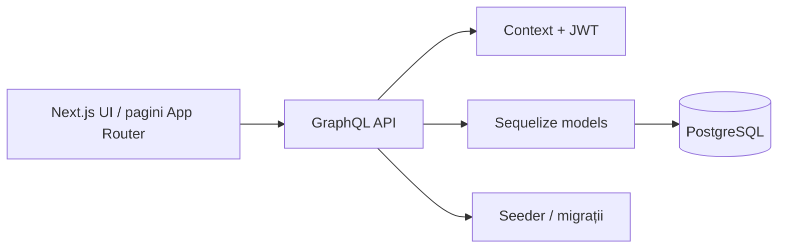
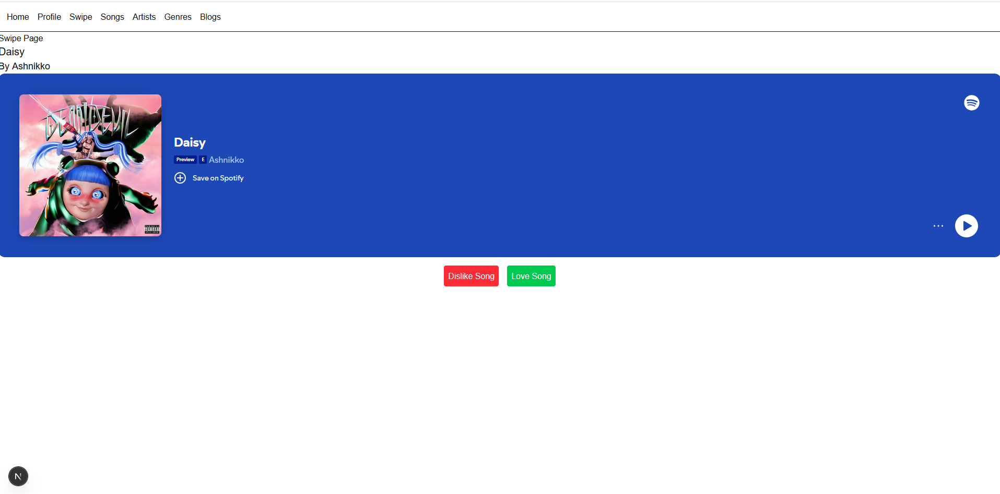
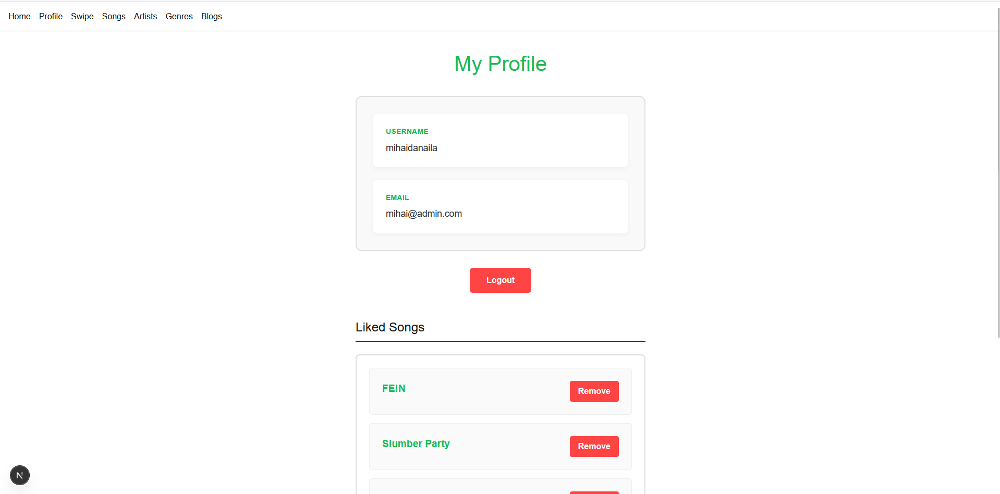
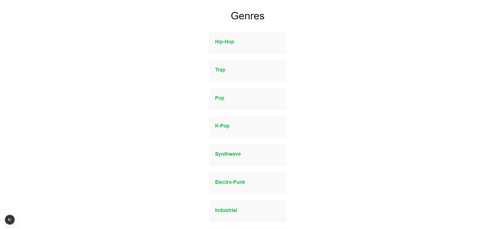
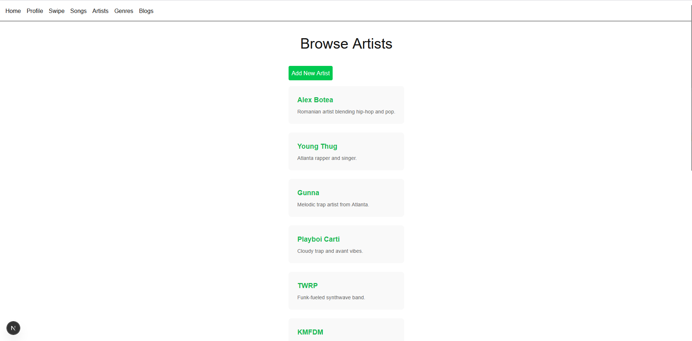

# JokeFacade-NodeJS

Aplicație web pentru muzică, artiști, genuri, bloguri și autentificare, construită cu Next.js, GraphQL și PostgreSQL.

## Ce face proiectul

- afișează și administrează melodii, artiști și genuri
- permite autentificare și sesiune pentru utilizatori
- oferă like-uri la melodii, comentarii și bloguri
- expune un API GraphQL pentru operațiile din aplicație

## Arhitectură



### Cum funcționează

1. Interfața din `play-this/app/` trimite cereri către serverul GraphQL.
2. `play-this/graphql/` definește schema, query-urile și mutation-urile.
3. `play-this/graphql/database.js` leagă modelele Sequelize de PostgreSQL.
4. `play-this/graphql/context.js` citește tokenul JWT și pune utilizatorul în context.
5. Datele sunt create/actualizate prin modele, migrații și seeders.

## Stack tehnic

- `Next.js` pentru frontend și routing
- `Apollo Server` pentru GraphQL
- `Sequelize` + `sequelize-cli` pentru ORM și migrații
- `PostgreSQL` ca bază de date
- `JWT` pentru autentificare

## Structură importantă

- `play-this/app/` — pagini și layout-uri Next.js
- `play-this/components/` — formulare și componente UI
- `play-this/graphql/` — schema, queries, mutations, context și conexiune DB
- `play-this/models/` — definițiile modelelor Sequelize
- `play-this/migrations/` — migrații pentru schema bazei de date
- `play-this/seeders/` — date inițiale pentru testare
- `Pictures/` — capturi de ecran folosite în documentație

## Screenshot-uri

### Swipe



### Profile



### Genres



### Artists



## Pornire locală

Din folderul `play-this/`:

```bash
npm install
npx sequelize-cli db:migrate
npx sequelize-cli db:seed:all
npm run dev
```

## Variabile de mediu

Fișierul `.env` trebuie să conțină:

```env
DATABASE=playThis
DB_USER=postgres
DB_PASSWORD=record44LABEL
DB_HOST=localhost
DB_PORT=5432
JWT_SECRET=dev-jwt-secret-change-me
```
